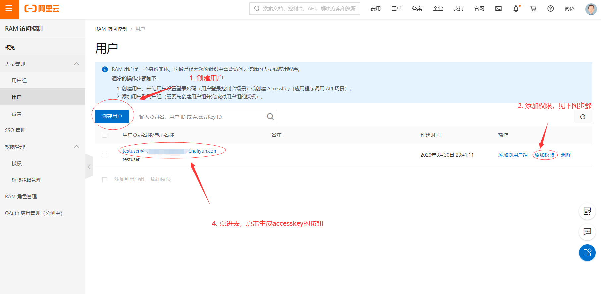
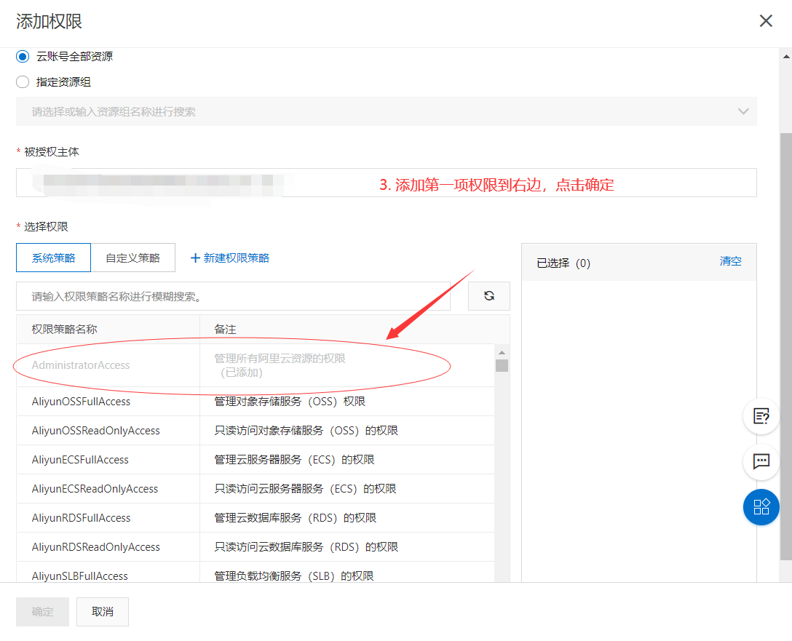

对阿里云上的常见API进行封装，方便不会编程的同学也可以方便地通过命令行管理阿里云上的实例。

使用方法概览：
```
Usage of C:\Users\minam\AppData\Local\Temp\go-build456432062\b001\exe\aliyun-control.exe:
  -accessKeyID string
        -accessKeyID <accessKeyID> 必选。
  -accessSecret string
        -accessSecret <accessKeyID> 必选。
  -action string
        -action <action> 必选。目前支持describeInstances, describeSecurityGroups, createSecurityGroup, stopInstance，startInstance，joinSecurityGroup (default "describeInstances")
  -instanceID string
        -instanceID [instanceID] 可选。atcion为stopInstance,startInstance,joinSecurityGroup时需要带上此参数,可通过describeInstances这一action获取。
  -regionID string
        -regionID <regionId> 必选。
  -securityGroupID string
        -securityGroupID [securityGroupID] 可选。atcion为joinSecurityGroup时需要带上此参数,可通过describeSecurityGroups这一action获取。也可以用createSecurityGroup创建一个默认全block的安全组。
```
action参数就是要进行的操作，和阿里云上的api名称一一对应。

现在支持describeInstances, describeSecurityGroups, createSecurityGroup, stopInstance，startInstance。joinSecurityGroup，执行的操作分别是，获取所有服务器信息，获取所有安全组信息，创建安全组（默认全屏蔽），停止实例，启动实例，把实例加入安全组。

有些操作如stopInstance，startInstance需要指定实例id，可以通过describeInstances获取。joinSecurityGroup除了实例id还需要安全组id，可以通过describeSecurityGroups获取或createSecurityGroup创建一个新的。

regionID是阿里云上服务器处于哪个大区的代号，比如华东2上海就是cn-shanghai，华东1杭州就是cn-hangzhou，华北2北京就是cn-beijing。accessKeyID和accessSecret是阿里云用于验证用户身份的凭据，需要在这里生成: https://ram.console.aliyun.com/users , 可以参考以下图片：



